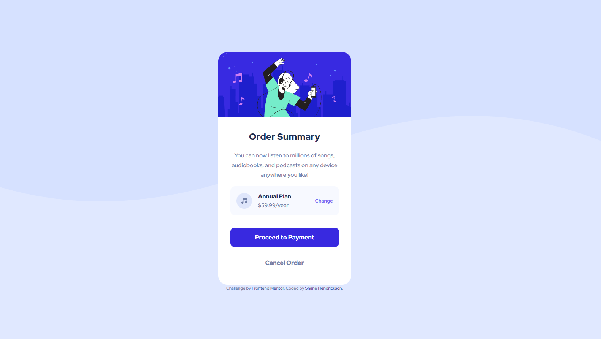

# Frontend Mentor - Order summary card solution

This is a solution to the [Order summary card challenge on Frontend Mentor](https://www.frontendmentor.io/challenges/order-summary-component-QlPmajDUj). Frontend Mentor challenges help you improve your coding skills by building realistic projects. 

## Table of contents

- [Overview](#overview)
  - [The challenge](#the-challenge)
  - [Screenshot](#screenshot)
  - [Links](#links)
- [My process](#my-process)
  - [Built with](#built-with)
  - [What I learned](#what-i-learned)
  - [Continued development](#continued-development)
  - [Useful resources](#useful-resources)
- [Author](#author)
- [Acknowledgments](#acknowledgments)

**Note: Delete this note and update the table of contents based on what sections you keep.**

## Overview

### The challenge

Users should be able to:

- See hover states for interactive elements

### Screenshot




### Links

- Solution URL: [Add solution URL here](https://github.com/shanehendrickson/FM-order-summary-component)
- Live Site URL: [Add live site URL here](https://steady-pavlova-5f5ca0.netlify.app/)

## My process

### Built with

- Semantic HTML5 markup
- CSS custom properties
- Flexbox
- CSS Grid
- Mobile-first workflow


### What I learned

Previously I did a Product Preview challegne. It turned out okay, but then after watching Kevin Powell do it, I realized I had made it way harder on myself than I needed to. This challenge was done using some things I saw him do. In particular, I combined CSS grid and flex to get spefific things the way I wanted them. Most of the project is laid out with a (very) simple grid. 

The "plan" section in the middle is also a grid. The middle column of that grid, which contains "Annual Plan" and the prices, is displayed with flex. That was just a quick and easy way to get them stacked.

```html
<div class="flex-group">
  <h2>Annual Plan</h2>
  <p>$59.99/year</p>            
</div>
```
```css
.flex-group {
  display: flex;
  flex-direction: column;
  line-height: 1.4rem;
  margin-left: 1rem;
  font-size: 0.9rem;
}
```


### Continued development

I wasn't a huge fan of CSS grid at first, but I can see how it has definite uses. I may actually prefer it. Either way, I know I need to study and practice it a lot more.

### Useful resources

- [Kevin Powell](https://www.youtube.com/@KevinPowell) - I'm honestly not sure I would understand CSS at all if it weren't for this guy.


## Author

- Website - [Shane Hendrickson](https://www.shanethedev.com/)
This is my portfolio. It's definitely a work in progress. It's built from scratch, but coded along (and slightly modified from) an example built by: (https://www.youtube.com/@OnlineTutorialsYT)
- Frontend Mentor - [@shanehendrickson](https://www.frontendmentor.io/profile/shanehendrickson)
- LinkedIn - [@shanethedev](https://www.linkedin.com/in/shanethedev/)


